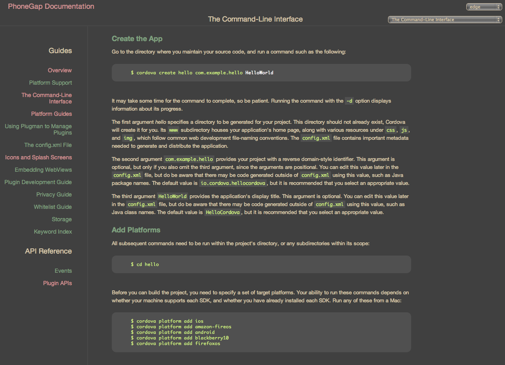

PhoneGap API - Zenburn Dark
==
A zenburn dark theme user-style for the Cordova PhoneGap API Docs (http://docs.phonegap.com) using Stylish

Get the 'Stylish' Browser Extension
--
  - [Chrome](https://chrome.google.com/webstore/detail/stylish/fjnbnpbmkenffdnngjfgmeleoegfcffe)
  - [Firefox](https://addons.mozilla.org/en-US/firefox/addon/stylish/)
  - [Safari](http://sobolev.us/stylish/)

Install This Theme From UserStyles.org
--
http://userstyles.org/styles/101474/phonegap-api-zenburn-dark

Pull Requests Are Welcomed
--
Help improve this user style and recommend new ones

Acknowledgements
--
Thanks to Jani Nurminen for devising "[Zenburn](http://slinky.imukuppi.org/zenburnpage/)"

License (CC0 1.0)
--

